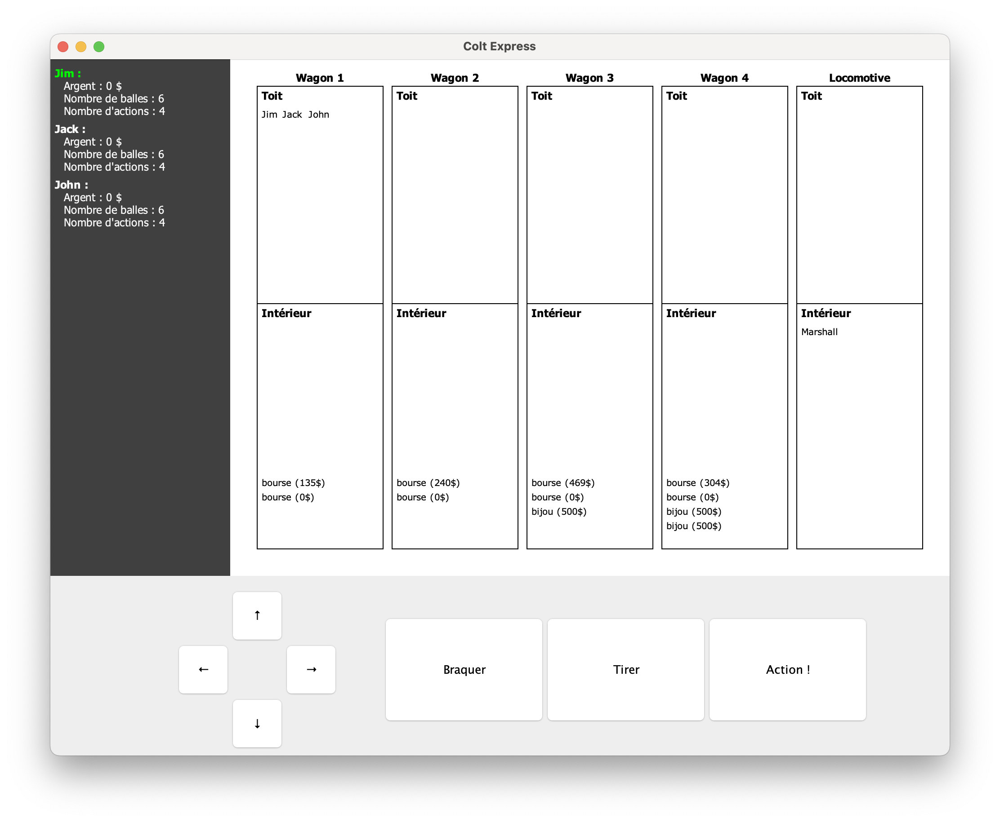
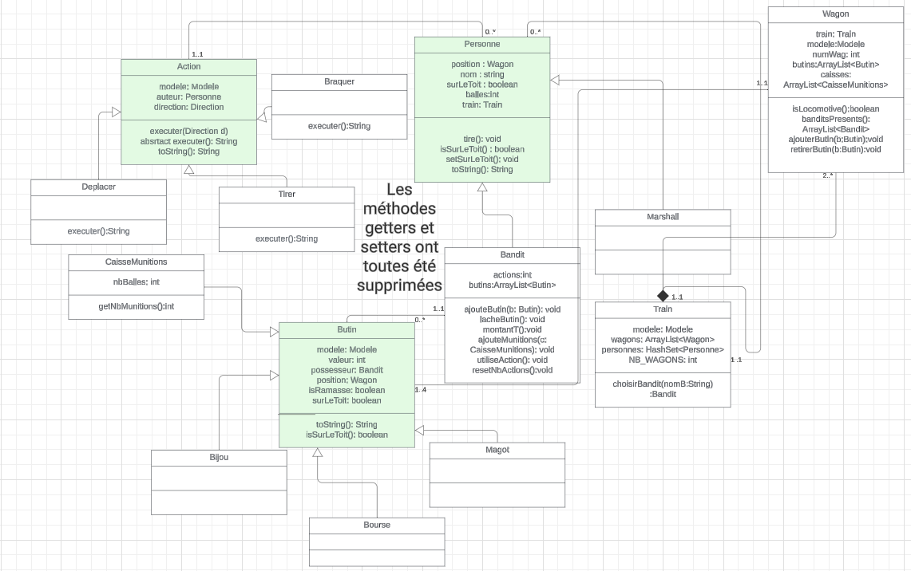

# Colt Express

## Overview du jeu

## Action Possible
Dans ce jeu, les personnages peuvent effectuer différentes actions pour interagir avec leur environnement :

__Déplacement__ : Les personnages peuvent se déplacer vers l'avant, l'arrière, le haut (sur le toit d'un wagon) ou le bas (dans le train), leur permettant ainsi de naviguer à travers les wagons du train.

__Braquage__ : Les bandits ont la possibilité de braquer un wagon pour voler des butins qui s'y trouvent. Cela leur permet de s'emparer de la richesse présente à bord du train.

__Tir__ : Les bandits peuvent utiliser une arme pour tirer sur d'autres personnages, généralement dans le but de les neutraliser et de leur voler leur butin.

__Interaction avec les objets__ : Les bandits peuvent également interagir avec différents objets présents dans les wagons, tels que des caisses de munitions ou d'autres butins, pour améliorer leurs chances de succès lors du braquage.

__Protection__ : Le Marshall a pour rôle de protéger le train en tirant sur les bandits qui tentent de le braquer. Il agit comme un défenseur de l'ordre et de la loi à bord du train, cherchant à préserver la sécurité et les biens des passagers.

## Les objets du jeu

__Train__

Le train est le principal cadre de l'action. Il est composé de plusieurs wagons, parmi lesquels se trouve le wagon locomotive, le plus important.
Chaque wagon peut contenir des personnages, des butins et des caisses de munitions, créant ainsi un environnement dynamique et riche en possibilités.

__Wagon__

Chaque wagon du train peut être identifié par un numéro ou un nom spécifique. Il constitue un espace autonome où se déroulent différentes actions du jeu.
Dans chaque wagon, les personnages peuvent trouver divers butins à voler, contribuant ainsi à l'intrigue et à la stratégie du jeu.

__Butin__

Les butins représentent la richesse à bord du train. Ils peuvent être de différents types, tels que des bourses, des bijoux ou des magots, chacun ayant une valeur monétaire spécifique associée.

__Caisse de Munitions__

Les caisses de munitions contiennent un stock de balles utilisables pour tirer. Elles sont stratégiquement placées à travers les wagons du train et peuvent être utilisées par les bandits pour s'armer et affronter leurs adversaires.

## Les personnages du jeu

__Bandit__

Les bandits sont les principaux antagonistes du jeu, cherchant à braquer le wagon pour s'emparer des précieux butins qu'il transporte. Ils peuvent se déplacer librement à bord du train et sont prêts à tout pour atteindre leur objectif.

__Marshall__

Le Marshall est le représentant de la loi et de l'ordre à bord du train.

Son objectif est d'empêcher les bandits de réussir leur braquage et de protéger les butins.

Le Marshall peut uniquement se déplacer à l'intérieur des wagons du train.

Il peut également tirer sur les bandits pour les neutraliser.

## Diagramme de classe

Un lien sur le diagramme de classe:https://lucid.app/lucidchart/7e134026-e836-4146-94f6-6f9adf469706/edit?viewport_loc=-1037%2C-808%2C3608%2C1571%2CHWEp-vi-RSFO&invitationId=inv_d4f1b9e7-2935-4a91-a4a3-e6867dc3e152

  
